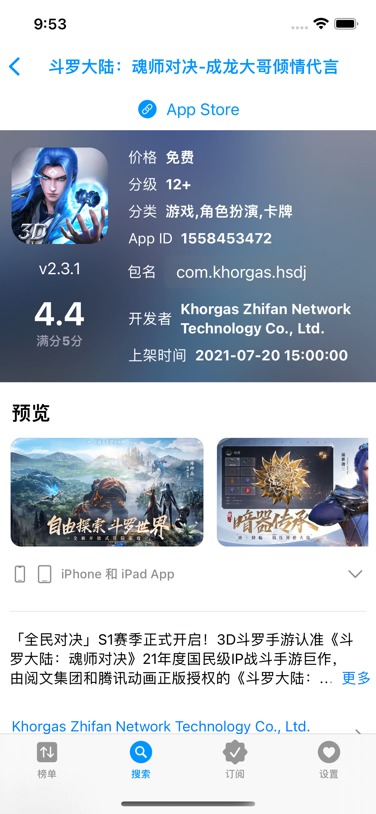
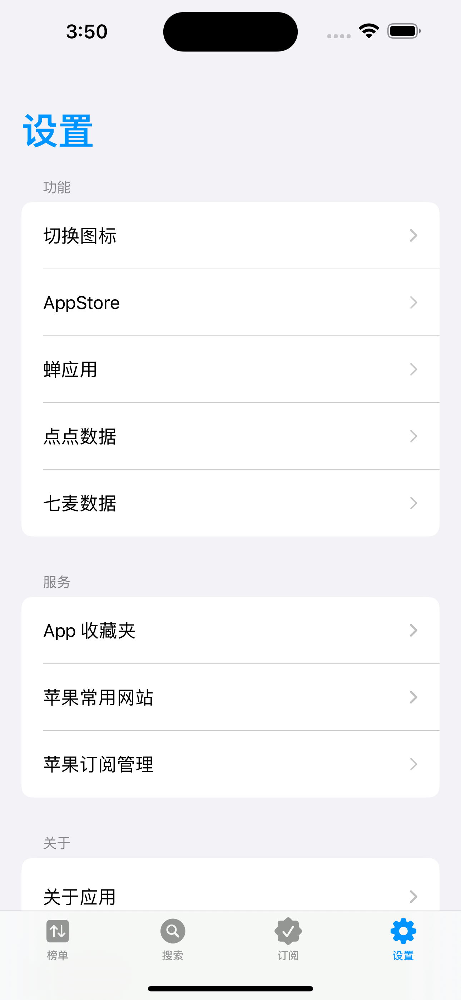
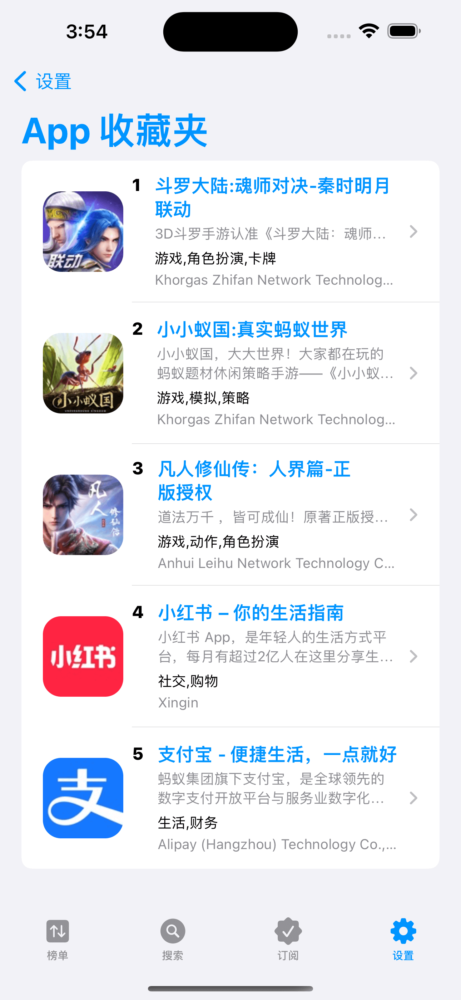

# iAppStore

## 1. 项目介绍

iAppStore 是一款使用 SwiftUI 打造的苹果商店工具类 App。

- 1、提供苹果实时榜单查询，包含 iOS 和 iPad 的热门免费榜、热门付费榜、畅销榜，还有新上架榜、新上架免费榜、新上架付费榜等。
- 2、提供查询 app 详细页面内容、搜索 app、订阅 app 状态等功能。
- 3、支持苹果所有国家和地区的商店，无需切换 Apple Id，即可查看！

> 本项目的发起原由：[用 SwiftUI 实现一个开源的 App Store - 掘金](https://juejin.cn/post/7051512478630412301)

## 2. 安装说明

### 2.1 iOS / iPadOS / Mac Apple Silicon

- iOS 14.0+
- iPadOS 14.0+
- macOS 11.0+（Mac Apple Silicon M1/M2+）

TestFlight 下载地址：[https://testflight.apple.com/join/XXEQdVKN](https://testflight.apple.com/join/XXEQdVKN)

> 注：
> 1. TestFlight 名额有限，先下先得！
> 2. 如无名额，iOS 和 iPadOS 需要自行编译安装。

### 2.2 macSO 安装包下载

- macOS 11.0+
- Mac Apple Silicon M1/M2+
- Mac Intel x86_64

- Mac 下载：[Releases](https://github.com/37iOS/iAppStore-SwiftUI/releases)

### 2.3 Xcode 构建

- 构建依赖：Xcode14+

下载项目后，双击 `iAppStore.xcodeproj` 打开项目即可编译，无需安装其它依赖库。

> 为了尽量更多的朋友入门 SwiftUI 学习，本项目未使用第三方框架，所以有一些功能实现简单，仅供参考。
> 另外，部分注释代码没有删除，是一些可能有价值的参考代码。

## 3. 效果示例

**iOS**

|  |  |
| ----- | ----- |
|  |  |
|  |  |
|  |  |

**macOS**

## 4. TODO

1. [x] 请求失败导致页面空白的处理（2022-02-02）
2. [] 数据请求可以按分页请求加载
3. [] 筛选国家地区的条件按洲显示或者支持搜索
4. [x] 筛选条件可以持久化保存（2022-01-09）
5. [x] 高清商店图片显示和下载（2022-01-09）
6. [x] 应用订阅状态持久化（2023-02-13）
7. [] 多语言的支持（英文）

## 5. FAQ

* [New Issue](https://github.com/37iOS/iAppStore-SwiftUI/issues)

### Contributors 

* [@iHTCboy](https://github.com/iHTCboy) 
* [@chenxi92](https://github.com/chenxi92)
* [@hyalpha](https://github.com/hyalpha)

### License

iAppStore is released under the GPL-3.0 license. [See LICENSE](https://github.com/37iOS/iAppStore-SwiftUI/blob/main/LICENSE) for details.
